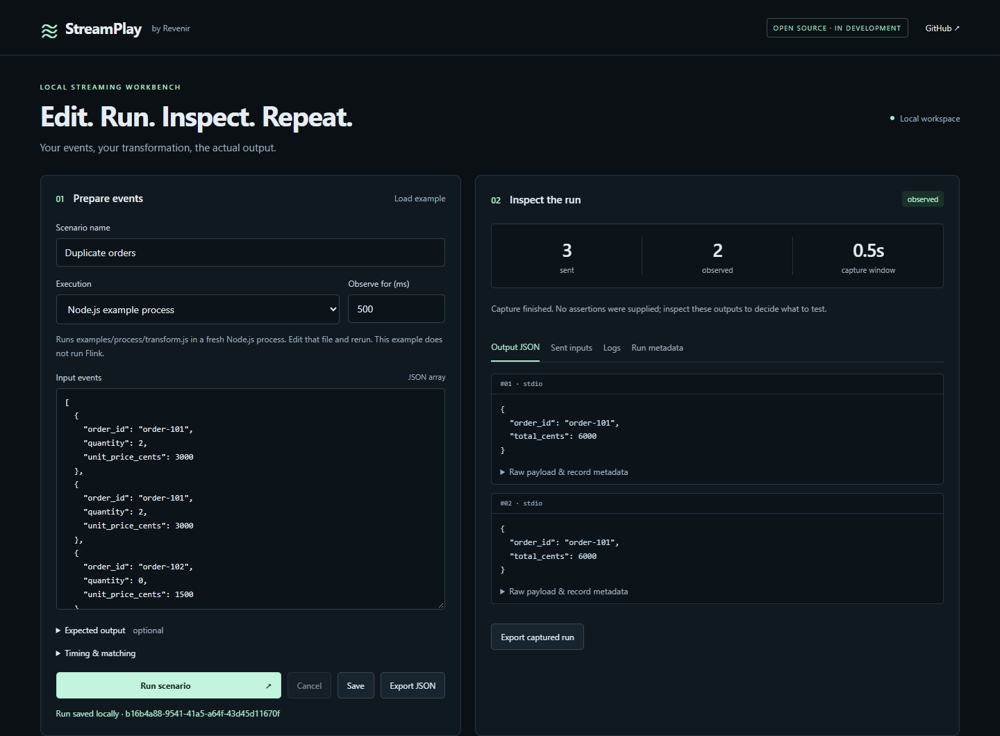

# StreamPlay

Live-source lab: `npm run lab`. Choose a source preset or use your own JSON template, add independent
sources, inspect their events and save evidence. Meter totals are an optional profile; StreamPlay also
supports ordinary application events and sensor measurements. See [setup and transports](docs/LIVE-SOURCES.md)
and the [local-lab capability inventory](docs/LAB-PARITY.md). The default lab is a JavaScript example;
`npm run lab -- --example kafka-flink` starts the real Kafka/Flink example.

**A local workbench for streaming development.**

[](https://github.com/revenirdata/streamplay/actions/workflows/ci.yml)
[](LICENSE)

**Open source · Early prototype · Not an MVP or a release yet**

Created by **[Carl Salazar (@kc-salazar)](https://github.com/kc-salazar)**. An open-source project by **[Revenir](https://www.revenirdata.com/streamplay)**.

Changing a streaming transformation often means juggling an editor, a producer, a consumer, logs, and yesterday's fixtures. StreamPlay brings the **edit → run → inspect → repeat** loop into one local workspace. Keep your application code in your editor. Send JSON events through it, inspect actual records, and retain the useful runs.

Start by exploring. Add expected outputs once you understand the behavior.



## Try the working development slice

Requires **Node.js 22+**. No account or cloud service needed.

```sh
git clone https://github.com/revenirdata/streamplay.git
cd streamplay
npm ci
npm start
```

Open **http://127.0.0.1:4317** and click **Run scenario**. Three sample events go through a real, separate Node.js process: two duplicate orders produce two outputs; a zero-quantity order produces none.

Edit [`examples/process/transform.js`](examples/process/transform.js), rerun, and compare the saved outputs. This quickstart exercises the workbench with a **Node.js example**, not Flink or a simulated streaming engine.

## Run Kafka → Flink → Kafka

With Docker Engine/Desktop and Compose v2 running, allocate roughly 4 GB RAM and sufficient disk for the images:

```sh
npm run example:up
npm start
```

Select **Kafka → your application → Kafka** in the workbench and run the same events. The packaged example uses **Apache Kafka 3.9.1**, **Apache Flink 1.20.2**, and **Flink Kafka SQL connector 3.3.0-1.20**. These are pinned example versions, not a claim to cover every version.

The transformation is ordinary [Flink SQL](examples/kafka-flink/orders.sql), executed by Flink. View the job at **http://127.0.0.1:18081**. To edit and resubmit it from a clean sandbox:

```sh
npm run example:down
# Edit examples/kafka-flink/orders.sql in your editor.
npm run example:up
```

`example:down` removes this example's Compose containers and volumes, including its Kafka data and Flink state. It does not delete saved workbench runs. Re-running `example:up` while the job is already running keeps that job; it does not apply SQL edits.

Run the same scenario without the browser:

```sh
npm run run:scenario -- examples/scenarios/orders.kafka.json
```

Exit code `1` means a mismatch or execution error. A scenario without `expected` captures observations; it does not assert correctness. [CI](https://github.com/revenirdata/streamplay/actions/workflows/ci.yml) starts the actual Kafka/Flink containers and checks two consecutive runs.

## What works in this first slice

- Edit JSON event arrays; execute the included process example or send to configured Kafka topics.
- Inspect raw input/output, Kafka offsets and partitions, producer acknowledgments, and process/adapter errors.
- Save local run snapshots and scenarios; export scenario JSON to Git.
- Compare outputs between runs with duplicate-sensitive, order-independent matching.
- Optionally assert exact output records over a declared observation window; run those scenarios in a terminal or CI.
- Inspect live records, cancel a run while retaining partial evidence, and reconnect after refreshing the browser.
- Pace events with explicit delays and compare selected JSON fields without changing raw evidence.
- Build named event phases for up to 20 identities, distinguish zero-valued events from silence, import saved scenarios/runs, and inspect planned versus actual send timing.
- Attach a trusted [experimental local adapter](docs/LOCAL-ADAPTERS.md) to an existing application.
- Navigate a dark [stream graph](docs/PIPELINE-GRAPH.md): named topics/streams, sources and processors, curved connections, raw-record inspection, and topology saved with each run.

The [product vision](docs/VISION.md) explains the deeper work next: portable application setup, explicit state/readiness, evidence comparisons and shareable regression cases.

Local data stays under `.streamplay/`, excluded from Git. No telemetry. Runs can include sensitive event data; use appropriate development fixtures.

## What a run means

Kafka capture records output offsets **before** publishing, joins a fresh observation consumer group, and reads committed records at or beyond that boundary. Previously captured offsets are excluded. Outputs arriving during setup or from another producer may still appear: **offset boundaries are not causal correlation**. Use dedicated sandbox topics and one application; do not point this prototype at production.

The full observation interval runs after the final input acknowledgment. `observed` means capture completed without assertions; `passed` means expected records matched during that interval; `failed` means they did not; `error` means execution/capture failed. A finite observation window cannot prove that no more outputs will arrive.

A new run does **not** reset Kafka topics, Flink state, or the external application. The process example starts fresh each time. Initial-state assumptions are recorded in run metadata. Capture is capped at 10,000 output records or 5 MB; overflow is an error, never a successful truncated run.

## Bring your application

To distinguish delayed events from unaccounted ones after an interruption, use
[delivery reconciliation](docs/DELIVERY-RECONCILIATION.md). It records exact IDs at named
checkpoints and includes a real MQTT before/after recovery demonstration.

### Repeatable event sequences

Expand **Build a device event sequence** to generate inputs from the first JSON event in the
editor. Choose the identity/value field paths, up to 20 distinct identities, and named phases.
An `emit` phase sends a numeric value at the chosen interval; a `silence` phase sends nothing.
An emitted zero is a real input, not silence. Generated inputs and timing remain editable JSON.
For a rate expressed in units/minute, `targetQuantity` can replace `durationMs`; this computes
the planned duration, not physical or downstream accumulated volume.

Sequences are capped at 1,000 events and 120 seconds. Generated schedules use a monotonic planned
timeline, so send latency does not add another full delay to every subsequent event. Overdue
events catch up; none are silently discarded. Run metadata records each event's planned time,
dispatch time, acknowledgement time, phase and lateness. This is a functional test tool, not a
hard real-time scheduler or a throughput benchmark.

`tailMs` preserves a final quiet interval before the post-input observation window. Outputs are
captured throughout sending, quiet time and observation. Relative scheduling remains available
for existing scenarios. **Import scenario or run JSON** restores the validated scenario without
importing credentials, executable code or connection settings. Save/export it, supply expected
outputs, and rerun in the browser or CLI; no supplied assertions means **observed**, not PASS.

These sequences work through the existing process, Kafka and trusted-local adapters. They do not
assume any private device protocol. Application state remains
adapter-defined; rerunning a plan does not imply restoring a checkpoint.

### Experimental MQTT application adapter

Use `examples/adapters/mqtt.js` as `STREAMPLAY_ADAPTER_MODULE` and select the local adapter.
Set `STREAMPLAY_MQTT_URL`, `STREAMPLAY_MQTT_INPUT_TOPIC`, and `STREAMPLAY_MQTT_OUTPUT_TOPIC`
at startup; optional credentials use `STREAMPLAY_MQTT_USERNAME` and `STREAMPLAY_MQTT_PASSWORD`.
Topics must be distinct, exact names. The adapter subscribes before sending, excludes retained
output, and uses QoS 1. A broker PUBACK does not establish successful application processing;
only captured outputs and your assertions determine a passed run. Use dedicated sandbox topics.
Application state is retained, and unrelated producers on those topics can contaminate capture.

This generic JSON adapter has been tested with isolated local Mosquitto and an independent
transform consumer, not remote TLS/authentication configurations or a device-specific protocol.
Run `node scripts/mqtt-integration.js` with the test broker on loopback port 18884 to reproduce
two successive runs, retained-message exclusion, and a deliberately failing output assertion.

### Processing is not delivery

A passing transformation scenario does not establish that a downstream queue has a consumer,
failed deliveries have a dead-letter route, or production alarms use published metrics. Keep
those contracts in your application's integration tests. A captured output or broker acknowledgement
is not a customer-delivery receipt. See [operational validation](docs/OPERATIONAL-VALIDATION.md)
for a reusable failure/recovery checklist and the evidence each check needs.

Start your app separately and bind it to isolated Kafka input/output topics. Configure the workbench through environment variables; credentials and shell commands are not accepted from the browser.

| Variable | Default |
| --- | --- |
| `STREAMPLAY_KAFKA_BROKERS` | `localhost:19092` |
| `STREAMPLAY_INPUT_TOPIC` | `streamplay-orders-in` |
| `STREAMPLAY_OUTPUT_TOPIC` | `streamplay-orders-out` |
| `STREAMPLAY_PORT` | `4317` |
| `STREAMPLAY_DATA_DIR` | `.streamplay` |

The initial Kafka adapter supports local plaintext brokers and JSON values. SASL/TLS configuration, record keys on input, schema registries, automatic app launch, and native engine log collection are future work. Local adapters can supply application logs. UTF-8 raw values and tombstone metadata are retained on output; binary decoding is not implemented. JSON assertions reject malformed records and tombstones rather than equating them with JSON strings or nulls.

## First-release direction

The first release targets these three paths:

| Path | Current state |
| --- | --- |
| Kafka → Flink → Kafka | Initial runnable example and integration CI |
| Kafka → Kafka Streams → Kafka | Planned; native example, lifecycle, and reset verification still needed |
| Kinesis → Flink → Kinesis | Planned; separate transport and AWS validation still needed |

Kafka and Kinesis move events. Flink and Kafka Streams process them. Their semantics and APIs differ; StreamPlay shares the workbench around them rather than pretending they are interchangeable. This public development repository precedes the first release; there is no claim that all three integrations are ready.

Trusted local bindings can now expose lifecycle controls, editable configuration, live observations, logs and state inspection in the workbench. See the experimental [application controls interface](docs/APPLICATION-CONTROLS.md). Application-specific commands and validation stay in the local binding.

See the [validation evidence and gaps](docs/VALIDATION.md), [roadmap](docs/ROADMAP.md), and [architecture](docs/ARCHITECTURE.md). There is no independent adoption evidence yet.

## Contribute

Start with [CONTRIBUTING.md](CONTRIBUTING.md). Useful early contributions include reproducible streaming scenarios, raw-data inspection improvements, and adapter correctness tests. The goal is a tool engineers return to while changing real transformations.

```sh
npm ci
npm run check
npm test
npx playwright install chromium
npx playwright test
```

**Creator and lead maintainer:** [Carl Salazar (@kc-salazar)](https://github.com/kc-salazar). **Project home:** [Revenir](https://github.com/revenirdata). [Maintainer model](MAINTAINERS.md) · [Apache-2.0 license](LICENSE).
## Inspect Flink recovery

Run `npm run lab:recovery` to inspect actual Kafka input/output JSON while a dedicated
stateful Flink worker is killed and restored from a checkpoint. The experiment checks
saved state and buffered inputs, and exports its evidence. [Setup and exact boundaries](docs/FLINK-RECOVERY.md).
