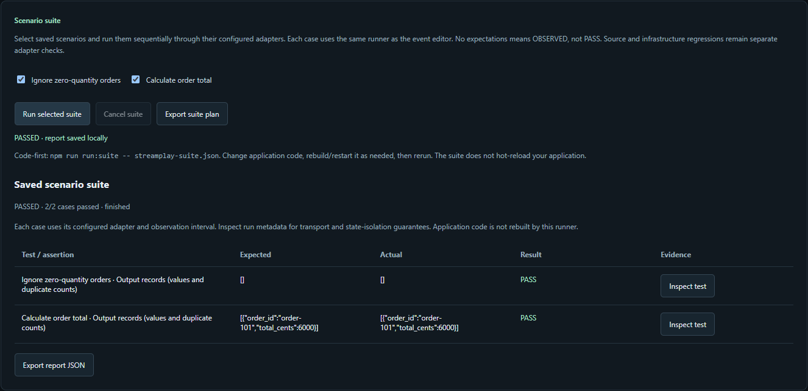
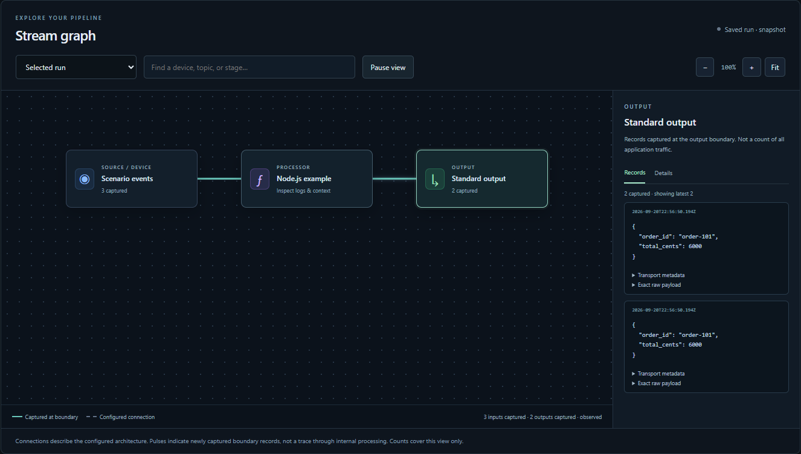
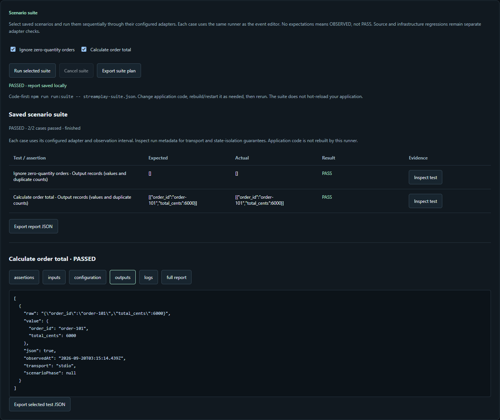

# StreamPlay

**An open-source local workbench for developing and testing streaming applications.**

[](https://github.com/revenirdata/streamplay/actions/workflows/ci.yml)
[](LICENSE)

Send controlled events through real processing code, inspect the raw inputs and outputs, and save useful experiments as regression tests. Keep your application in your editor; use StreamPlay to see and test its behavior.

**Input → real processing logic → output → validation.**

Created and maintained by **[Carl Salazar (@kc-salazar)](https://github.com/kc-salazar)** at **[Revenir](https://www.revenirdata.com/streamplay)**. Apache-2.0. Active development; no stable release yet.



*Actual execution of the included Node.js example. The same runner powers the browser and CLI. This screenshot is not a Flink result.*

## Start locally

Requires Node.js 22+. No account, paid backend or AI service.

```sh
git clone https://github.com/revenirdata/streamplay.git
cd streamplay
npm ci
npm start
```

Open **http://127.0.0.1:4317** and click **Run scenario**. The included [Node.js process](examples/process/transform.js) calculates order totals: two duplicate inputs produce two outputs, while a zero-quantity input produces none. It deliberately does not deduplicate. Edit that file, rerun, inspect the output, and add expectations when you know the correct behavior.

Run a complete saved suite without opening the UI:

```sh
npm run run:suite -- examples/suites/orders.process.json
```

For independent live sources and lifecycle controls, run **`npm run lab`**. Choose an event preset or your own JSON template, add sources, configure values and cadence, and inspect each source's records. [Live-source setup](docs/LIVE-SOURCES.md).

## What you can do



- **Inspect the pipeline.** A dark graph shows named topics/streams, sources, processors and outputs. Click a node for captured JSON and metadata; pause inspection while capture continues. Graph edges describe architecture, not inferred per-event causality.
- **Prepare controlled inputs.** Paste JSON, import NDJSON with original-line errors, or generate timed phases. Model application events, sensor readings or meters with configurable fields and seeded profiles. Up to 20 independent live sources by default.
- **Run real code.** Use the process quickstart, the Kafka boundary adapter, or a trusted local application binding. Source and sink transports can differ.
- **Assert behavior.** Run one scenario or a suite. See expected versus actual output, duplicate counts, each test's records and logs, and explicit PASS/FAIL/ERROR/NOT RUN states. No expectations means OBSERVED, not PASS.
- **Retain evidence.** Save runs, compare outputs, export scenarios and suite reports, and keep partial results on cancellation. View metadata without hiding the original payload.
- **Exercise recovery.** The included Kafka/Flink experiment kills a worker and checks checkpoint restoration. Delivery reconciliation compares exact record IDs at checkpoints; local queue tests exercise retry, dead-letter preservation and recovery.



## Runnable streaming examples

These are pinned, local examples with integration tests—not universal engine or production certification. Docker Engine/Desktop with Compose v2 is required for JVM examples; leave room for several GB of images and runtime memory.

| Application path | What it exercises | Start / instructions |
| --- | --- | --- |
| Kafka → Flink SQL → Kafka | Real SQL transform, duplicate-sensitive capture, repeated runs | `npm run example:up` · [SQL](examples/kafka-flink/orders.sql) |
| Kafka → Kafka Streams JVM → Kafka | Persistent deduplication, aggregation, retained state, JVM restart and explicit reset | `npm run example:kafka-streams` · [guide](examples/kafka-streams/README.md) |
| Local Kinesis → Flink JVM → local SQS | Staged input, keyed timeout/recovery timers, live raw output and a dedicated queue observer | `npm run example:kinesis-flink` · [guide](examples/kinesis-flink-sqs/README.md) |
| MQTT → independent application → MQTT | Subscribe-before-send, QoS 1 acknowledgments, retained-output exclusion | [adapter guide](docs/LOCAL-ADAPTERS.md) · `examples/adapters/mqtt.js` |
| Software MQTT fleet → 1-4 candidate brokers | Persistent clients, stable event IDs, duplicate/reconnect injection, acknowledgement ledger and latency percentiles | `npm run simulate -- examples/simulations/mqtt-fleet.local.json` · [guide](docs/FLEET-SIMULATION.md) |

Kafka/Flink uses Kafka 3.9.1, Flink 1.20.2 and Kafka SQL connector 3.3.0-1.20. The JVM examples use Kafka Streams 3.9.1 / Flink 1.20.2 and Java 17. Kinesis and SQS are emulated by LocalStack 4.14.0; the Flink processing is real. See [CI and validation boundaries](docs/VALIDATION.md).

For the Kafka/Flink example, start the workbench with `npm start`, select **Kafka → your application → Kafka**, and run the fixture. The Flink UI is at **http://127.0.0.1:18081**. `npm run example:down` removes only that example's containers and volumes, including broker data and Flink state; saved workbench runs remain. To apply SQL edits, stop/reset and start the example again.

The fleet simulator is headless so hundreds or thousands of persistent clients do not become browser objects. A profile can publish the same stable event IDs to multiple isolated MQTT targets and retain a receipt ledger under `.streamplay/simulations/`. MQTT acknowledgement establishes only what the broker accepted; end-to-end delivery still requires reconciliation at the stream, processor, output and failure-store boundaries. Remote targets require an explicit `--allow-remote` flag, and production-like hostnames are rejected. Credentials are read from named environment variables rather than the profile.

## Bring your application

Run your application separately and configure isolated Kafka input/output topics before starting StreamPlay:

| Environment variable | Default |
| --- | --- |
| `STREAMPLAY_KAFKA_BROKERS` | `localhost:19092` |
| `STREAMPLAY_INPUT_TOPIC` | `streamplay-orders-in` |
| `STREAMPLAY_OUTPUT_TOPIC` | `streamplay-orders-out` |
| `STREAMPLAY_PORT` | `4317` |
| `STREAMPLAY_DATA_DIR` | `.streamplay` |
| `STREAMPLAY_ADAPTER_MODULE` | Optional trusted local adapter |
| `STREAMPLAY_TOPOLOGY_FILE` | Optional declared graph JSON |

For other transports and application-specific controls, use a [local adapter](docs/LOCAL-ADAPTERS.md) and [application controls binding](docs/APPLICATION-CONTROLS.md). Bindings can expose configuration, readiness, logs, state inspection, test suites and lifecycle actions. They are trusted local code, not uploaded browser scripts.

The bundled Kafka adapter currently supports plaintext local brokers and JSON values. SASL/TLS, input keys, schema registries and binary decoding are not implemented. Output offsets, partitions, timestamps, headers and tombstones are retained. [Full capability inventory](docs/LAB-PARITY.md).

## What a passing run means

- PASS means the captured records matched the supplied expectations during a declared interval. It does not prove eventual completeness or customer delivery.
- Each run records its execution conditions. Starting a new run does **not** reset external application state. Reset behavior belongs to the application binding or example lifecycle.
- Kafka observations start at recorded output offsets with a fresh consumer group. These boundaries exclude earlier offsets but do not prove causal correlation; use dedicated test topics without unrelated producers.
- Queue observers may consume messages. The public SQS pilot requires sole ownership and documents its capture/acknowledgment behavior. Capture is held in memory until completion; it is not crash-safe archival.
- Limits are explicit: 1,000 input events, a 512 KB fixture budget, and 10,000 output records or 5 MB. Overflow, capture and cleanup failures remain errors.

Local runs are stored under `.streamplay/`, excluded from Git. No telemetry. [Scenario suites](docs/SCENARIO-SUITES.md) · [pipeline graph](docs/PIPELINE-GRAPH.md) · [fleet simulation](docs/FLEET-SIMULATION.md) · [Flink recovery](docs/FLINK-RECOVERY.md) · [delivery reconciliation](docs/DELIVERY-RECONCILIATION.md).

## Development and contributions

Start with [CONTRIBUTING.md](CONTRIBUTING.md). Useful contributions are reproducible streaming scenarios, clearer evidence inspection, and adapter correctness tests. An example running successfully is not proof that independent engineers find the tool useful; that remains a release gate.

```sh
npm run check
npm test
npx playwright install chromium
npx playwright test
```

[Vision and scope](docs/VISION.md) · [roadmap](docs/ROADMAP.md) · [validation](docs/VALIDATION.md) · [architecture](docs/ARCHITECTURE.md) · [maintainers](MAINTAINERS.md) · [license](LICENSE).
